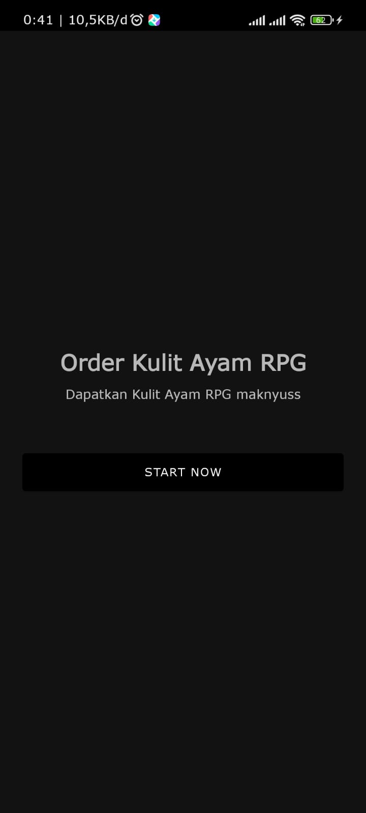
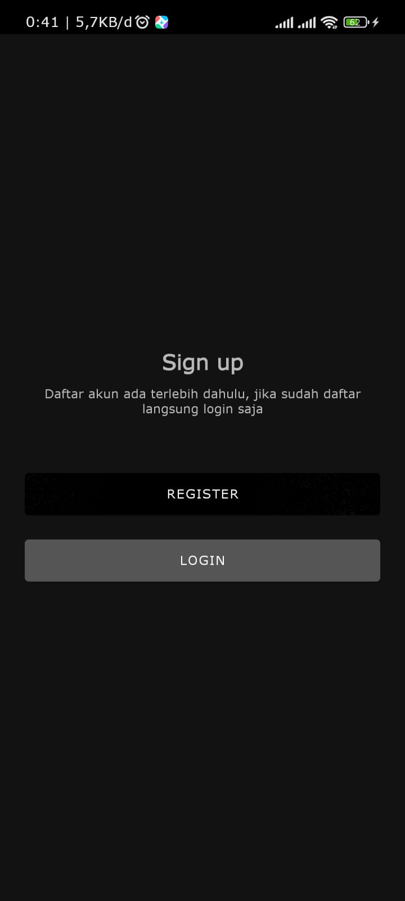
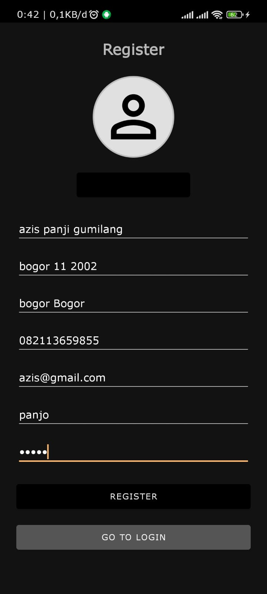
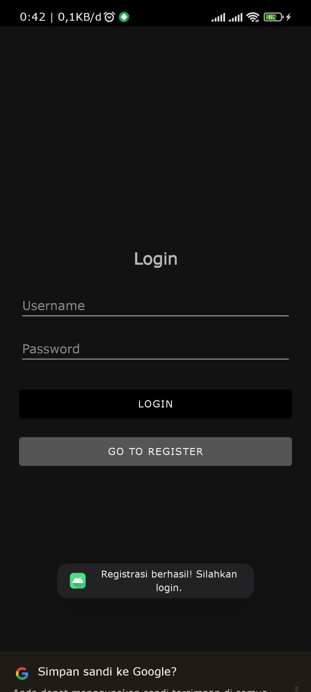
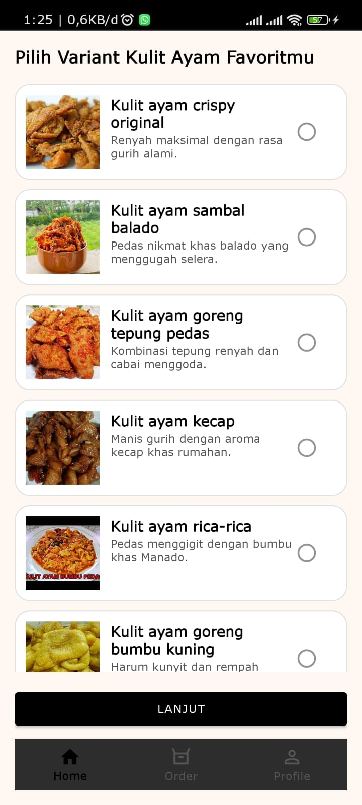
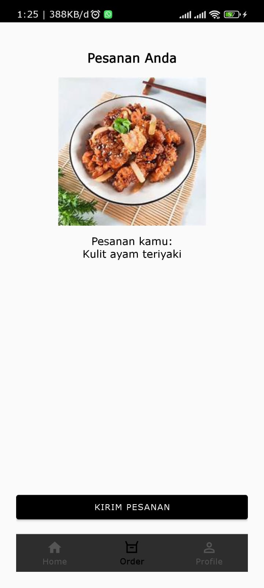
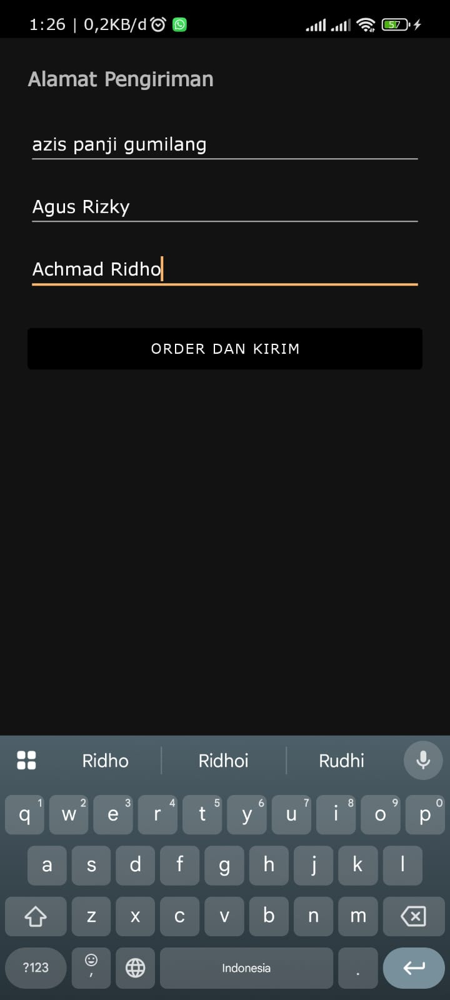
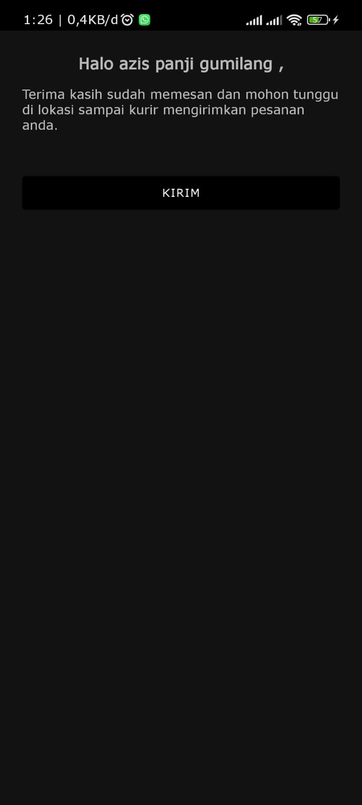
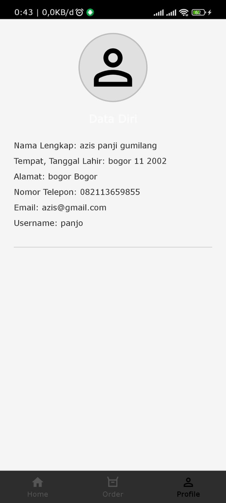

# 🍗 Order Kulit Ayam RPG

Aplikasi **Order Kulit Ayam RPG** merupakan project tugas mata kuliah **Pengembangan Aplikasi Mobile**.  
Aplikasi ini dibuat menggunakan **Kotlin** di **Android Studio**, berfokus pada tampilan (frontend) tanpa integrasi database atau backend.  
Tujuan project ini adalah memahami alur desain antarmuka dan navigasi antar activity dalam pengembangan aplikasi Android.

---

## 🚀 Fitur Utama

| No | Screen | Halaman | Fungsi |
|----|---------|----------|--------|
| 1 | Splash / Welcome | Tampilan awal dengan tombol **"Start Now"** menuju halaman login / register |
| 2 | Pilihan Awal | Pengguna memilih **Login** atau **Register** |
| 3 | Login | Autentikasi sederhana menuju halaman **Menu Makanan (Home)** |
| 4 | Register | Registrasi sederhana menuju **Menu Makanan (Home)** |
| 5 | Menu Makanan (Home) | Menampilkan daftar menu kulit ayam |
| 6 | Detail Makanan | Menampilkan detail item makanan dan tombol menuju **Form Alamat** |
| 7 | Form Alamat | Formulir pengisian alamat pengiriman |
| 8 | Terima Kasih | Tampilan konfirmasi setelah pesanan dikirim |
| 9 | Profile | Tampilan identitas pemesan |


---

## 🧩 Teknologi yang Digunakan

- **Android Studio** (Arctic Fox atau di atasnya)
- **Kotlin**
- **XML Layout**
- **Material Components**
- **Vector Assets & Drawable Resources**

---

## 🗂️ Struktur Folder Penting

```text
app/
├── src/
│   ├── main/
│   │   ├── java/com/example/orderkulitayam/    # Folder file Kotlin
│   │   ├── res/
│   │   │   ├── drawable/                       # Gambar dan icon (kulit ayam, tombol, dll)
│   │   │   ├── layout/                         # File XML tampilan (activity_main.xml, dll)
│   │   │   └── values/                         # Warna, string, style
│   │   └── AndroidManifest.xml                 # Konfigurasi aktivitas aplikasi
```
---

## 🧠 Cara Menjalankan di Laptop/PC

1. Pastikan sudah terinstal:
   - [Android Studio](https://developer.android.com/studio)
   - Java Development Kit (JDK 11 atau lebih)
2. Clone repository:
   ```bash
   git clone https://github.com/<username_github>/<nama_repository>.git
Buka project di Android Studio → tunggu hingga Gradle selesai sync.

Pilih device emulator atau hubungkan HP dengan mode Developer Mode + USB Debugging aktif.

Tekan tombol Run ▶ untuk menjalankan aplikasi.

# 📸 Screenshot Project

Berikut adalah tampilan dari proyek ini:

|  |  |  |
|:------------------------:|:------------------------:|:------------------------:|
| Tampilan 1 | Tampilan 2 | Tampilan 3 |

|  |  |  |
|:------------------------:|:------------------------:|:------------------------:|
| Tampilan 4 | Tampilan 5 | Tampilan 6 |

|  |  |  |
|:------------------------:|:------------------------:|:------------------------:|
| Tampilan 7 | Tampilan 8 | Tampilan 9 |


